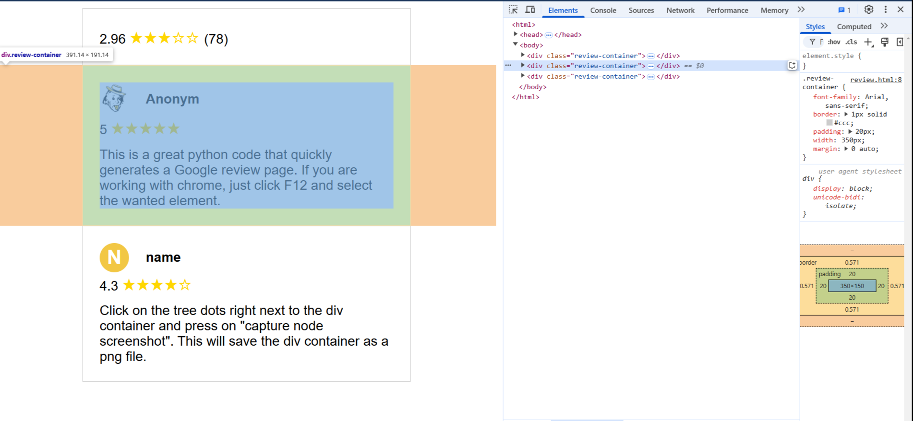

# GoogleRezession README

This project generates a Google-style review page using Python. The script creates an HTML file that displays user reviews with star ratings and profile pictures.

## Features

- Generates random profile pictures and colors for user initials.
- Displays average review stars.
- Creates a list of user comments with star ratings and review text.
- Saves the generated HTML content to a file and opens it in the default web browser.

## Functions

### `get_random_color()`
Returns a random color from a predefined list.

### `get_random_profile_picture()`
Returns a random profile picture path from a predefined list.

### `insert_average_rezession(rezession_stars, anzahl_rezessionen)`
Generates HTML content for displaying the average review stars and the number of reviews.

### `insert_profile_head()`
Generates HTML content for displaying a random profile picture.

### `insert_profile_color(letter)`
Generates HTML content for displaying a colored circle with the user's initial.

### `insert_Google_Rezession(user, stars, text, head=False)`
Generates HTML content for a single user review. If `head` is `True`, a profile picture is used; otherwise, a colored initial is used.

### `create_comment_list(comments)`
Generates HTML content for a list of user comments.

## Usage

1. Define the list of comments with user names, star ratings, and review text.
2. Set the average review stars and the number of reviews.
3. Run the script to generate the HTML content and save it to a file.
4. The script will automatically open the generated HTML file in the default web browser.

